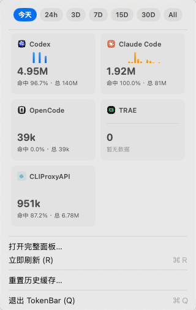
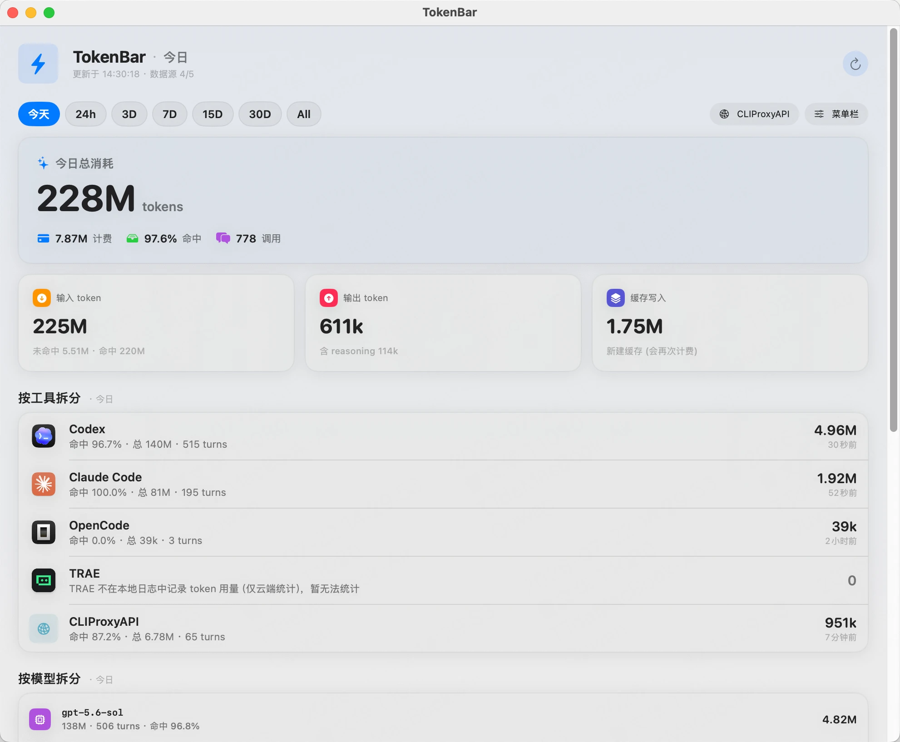

# TokenBar

一个 macOS 菜单栏小工具，统计本机 Codex / Claude Code / OpenCode / TRAE（以及可选的 CLIProxyAPI 反代）这些 AI CLI 工具实际消耗了多少 token，原生 SwiftUI 实现，不联网、不上传任何数据（CLIProxyAPI 这一项除外，见下文）。

## 截图

> 这台构建/开发用的环境是无头（headless）沙盒，没有真实可交互的桌面会话，没法截到真实运行画面。等你在自己机器上跑起来之后，把菜单栏下拉和完整面板的截图放到 `docs/screenshot-menu.png`、`docs/screenshot-dashboard.png`，然后把下面两行取消注释就行。

<!--  -->
<!--  -->

菜单栏下拉大概长这样：顶部一排时间窗口（今天/24h/3D/7D/15D/30D/全部)胶囊,下面 2x2（或更多)工具卡片,每张卡片是图标+名称+迷你走势条+计费 token（大字)+命中率/总量（小字)。完整面板则是同样风格的放大版,外加按模型拆分、可独立筛选时间和指标（计费/总量/turns)的消耗趋势图。

## 功能

- **菜单栏**：默认只显示一个数字——当前时间窗口下的计费 token 消耗（可在面板里改成总 token / 缓存命中率 / turns / 刷新时间)。
- **下拉菜单**：不点击就能看的快速概览，时间窗口胶囊 + 各工具卡片,点胶囊切换时间窗口不会关闭菜单。
- **完整面板**：总消耗 hero 卡片、输入/输出/缓存写入统计、按工具拆分（分组列表)、按模型拆分、消耗趋势图（独立时间窗口+独立指标筛选,悬停显示每根柱子里各工具的具体数值)。
- **每 30 秒自动增量刷新**，首次启动或修复统计口径后会做一次全量历史回溯（不是只从装上那一刻开始算)。
- 右键（或左键)菜单栏图标可以"立即刷新""重置历史缓存""退出"。

## 支持的数据源

| 数据源 | 数据来源 | 能拿到什么 | 备注 |
|---|---|---|---|
| Codex | `~/.codex/sessions`、`~/.codex/archived_sessions` 下的 rollout JSONL | 完整 token（含缓存)、模型名、turns | 增量分块读取,不会因为单个文件几个 GB 而卡死 |
| Claude Code | `~/.claude/projects/**/*.jsonl` | 完整 token、模型名、turns | 按 `message.id` 去重,避免同一次调用的多个内容块重复计数 |
| OpenCode | `~/.local/share/opencode/opencode.db`（SQLite `message` 表) | 完整 token、模型名、turns | 按消息 id 游标增量扫描 |
| TRAE | `~/Library/Application Support/Trae*/logs` | 无 token 数据 | TRAE 本地不落 token 用量（仅云端统计),只显示"暂无法统计"的说明,不编数字 |
| CLIProxyAPI（可选) | 你自建反代的 `/v0/management/usage-queue` HTTP 接口 | 完整 token、`account/model` 拆分 | 唯一会发起本机网络请求的数据源,需要在面板里手动填地址+管理密钥才会启用,见下 |

## 环境要求

- macOS 14 (Sonoma) 及以上
- Xcode 15 / Swift 5.9 及以上的命令行工具（`swift build` 能跑就行,不需要打开 Xcode)

## 构建 & 运行

```bash
# 编译 + 跑测试
swift build
swift test

# 打包成 .app 并装到 /Applications（默认行为）
./scripts/build-app.sh

# 只打包，不安装
./scripts/build-app.sh --no-copy
```

打包脚本会编译 release 二进制、生成 App 图标、拼装 `.app` bundle（把 SwiftUI 资源 bundle 和真实工具图标一起塞进去),默认拷贝到 `/Applications/TokenBar.app`。装好之后：

```bash
open /Applications/TokenBar.app
```

菜单栏就会出现图标。这个 App 是 `LSUIElement`（不进 Dock、不出现在 Cmd+Tab),常驻后台。

开发时也可以不打包直接跑调试版二进制：

```bash
swift run TokenBar
```

还有个一次性 CLI 扫描模式，不启动菜单栏 UI,直接把统计结果打印到终端（方便调试数据源本身对不对):

```bash
swift run TokenBar --cli
```

## 使用

1. 装好并打开后,菜单栏会出现一个图标 + 一个数字（默认是"计费 token"),点一下弹出下拉菜单。
2. 下拉菜单顶部选时间窗口,下面几张工具卡片会跟着变。
3. 点"打开完整面板…"看更详细的统计和趋势图。
4. 面板顶部"菜单栏"按钮可以改菜单栏显示哪个指标；"CLIProxyAPI"按钮可以配置反代地址和管理密钥。

### 接入 CLIProxyAPI（可选）

如果你在用 [CLIProxyAPI](https://github.com/router-for-me/CLIProxyAPI) 这类反代,并且它的 `usage-statistics-enabled: true` 已经打开（这是它自己 `config.yaml` 里的配置,不是 TokenBar 这边),可以在完整面板的"CLIProxyAPI"设置里填两项：

- **地址**：比如 `localhost:8899`（不填就不会扫这个数据源)
- **管理密钥**：对应 CLIProxyAPI `remote-management.secret-key`,TokenBar 会用 `Authorization: Bearer <key>` 去调它的 `/v0/management/usage-queue` 接口

这两项只存在本机 `~/Library/Application Support/TokenBar/cliproxyapi_config.json` 里,不会写进代码仓库,也不会传去别处。

注意：这个接口是"弹出即消费"的队列（`PopOldest`),如果你还有别的工具也在轮询同一个接口,会互相抢数据；另外它的数据只在 CLIProxyAPI 自己配置的 `redis-usage-queue-retention-seconds` 窗口内保留（内存队列,重启即丢),TokenBar 靠自己 30 秒一次的常规刷新节奏去追,只要这个保留时间不小于 30 秒就不会漏。

## 工作原理简述

- 每个数据源实现同一个 `TokenSource` 协议的 `collect() async throws -> SourceResult`,各自负责把自己格式的原始日志/数据库/HTTP 响应,归一化成统一的 `TokenSample`（`inputTokens` 恒为剔除缓存后的新鲜输入、`reasoningTokens` 是 `outputTokens` 的展示用子集不重复计入总量)。
- `UsageStore` 每 30 秒调用所有数据源,增量合并进按天/按小时的桶（`dayBuckets`/`hourBuckets`),而不是每次都重新扫一遍全部历史。
- `MigrationState` 记录一个 schema 版本号,统计口径有破坏性修复时版本号跟着提升,下次启动会自动清空缓存做一次全量重扫,而不是让新旧口径的数据混在一起。
- UI（`DashboardView.swift`/`MenuBarRowViews.swift`)只读已经算好的 `UsageSnapshot`,不在视图里重新扫描原始样本。

代码都在 `Sources/TokenBar/` 下,每个数据源一个文件,`Tests/TokenBarTests/` 有对应的单元测试（`swift test` 直接跑)。

## 隐私

除了可选的 CLIProxyAPI 集成（连你自己配置的本机/内网地址),TokenBar 不发起任何网络请求，只读本机已有的日志文件/数据库,统计结果只存在你自己的 `~/Library/Application Support/TokenBar/` 下。
